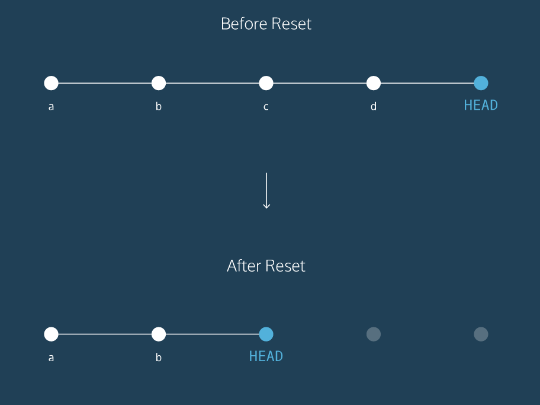

# Useful common `git` commands. 

### Use Git commands to help keep track of changes made to a project:  
`git init` creates a new Git repository  
`git status` inspects the contents of the working directory and staging area  
`git add filename` adds files from the working directory to the staging area  
`git diff` shows the difference between the working directory and the staging area  
`git commit` permanently stores file changes from the staging area in the repository  
* `git commit -m "Complete first line of dialogue"`  
`git log` shows a list of all previous commits  

### Backtrack Related Commands
`git show HEAD`: see the HEAD commit.  

### Three different ways to backtrack in Git.  
`git checkout HEAD filename`: Discards changes in the working directory.   
`git reset HEAD filename`: Unstages file changes in the staging area.  
`git reset SHA`: Can be used to reset to a previous commit in your commit history.  
This command works by using the first 7 characters of the SHA of a previous commit. For example, if the SHA of the previous commit is 5d692065cf51a2f50ea8e7b19b5a7ae512f633ba, use: `git reset 5d69206`.  

  

#### Before reset:
`HEAD` is at the most recent commit  
#### After resetting:
* `HEAD` goes to a previously made commit of your choice
* The gray commits are no longer part of your project  
* You have in essence _rewinded_ the project's history

### Git _branching_ allows users to experiment with different versions of a project by checking out separate branches to work on.

The following commands are useful in the Git branch workflow.

`git branch`: Lists all a Git project's branches.  
`git branch branch_name`: Creates a new branch.  
`git checkout branch_name`: Used to switch from one branch to another.  
`git merge branch_name`: Used to join file changes from one branch to another.  
`git branch -d branch_name`: Deletes the branch specified.  

### A _remote_ is a Git repository that lives outside your Git project folder. Remotes can live on the web, on a shared network or even in a separate folder on your local computer.
### The _Git Collaborative Workflow_ are steps that enable smooth project development when multiple collaborators are working on the same Git project.

Remember following commands

`git clone`: Creates a local copy of a remote.  
`git remote -v`: Lists a Git project's remotes.  
`git fetch`: Fetches work from the remote into the local copy.  
`git merge origin/master`: Merges origin/master into your local branch.  
`git push origin <branch_name>`: Pushes a local branch to the origin remote.  

## Link: [Details of there commands can be found on the Codecademy.](https://www.codecademy.com/learn/learn-git)
